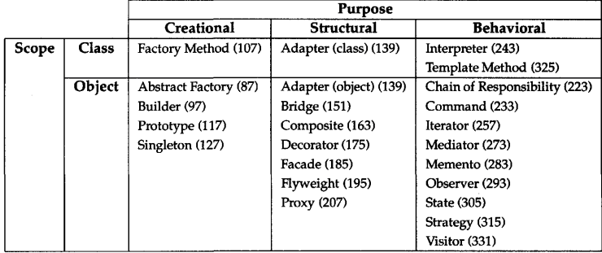
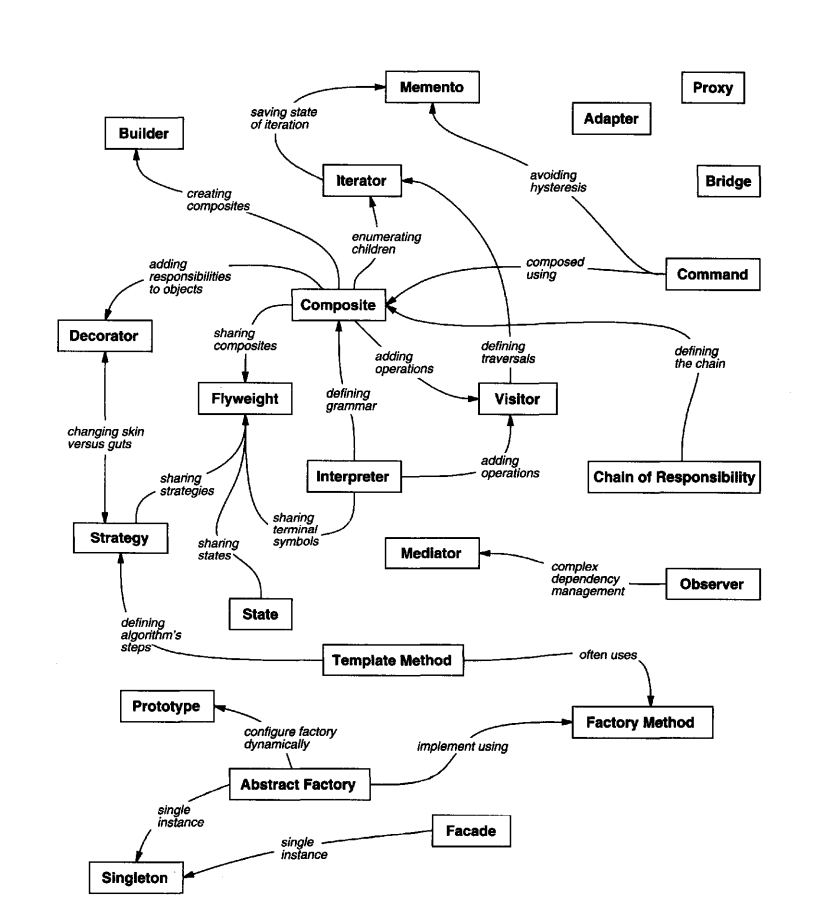
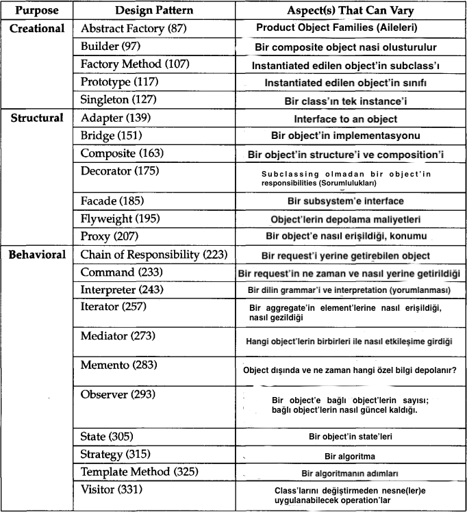

## Abstract Factory Design Pattern

İlgili veya bağımlı nesnelerin concrete sınıflarını belirtmeden bir family (aile) oluşturma için bir arayüz sağlayın.

## Adapter Design Pattern

Bir sınıfın interface'ini client'ların beklediği başka bir interface'e dönüştürün. Adapter, uyumsuz interface'ler
nedeniyle başka türlü birlikte çalışamayan sınıfların birlikte çalışmasını sağlar.

## Bridge Design Pattern

Bir abstraction'i implementasyonundan ayırın, böylece ikisi bağımsız olarak değişebilir

## Builder Design Pattern

Complex bir nesnenin construction'ını representation'dan ayırın, böylece aynı construction süreci farklı
representation'lar oluşturabilir

## Chain of Resposibility

Birden fazla nesneye request'i işleme şansı vererek request sender'i receiver'a bağlamaktan kaçının. Receiver nesneleri
chain edin ve bir nesne handle edilinceye kadar request'i chain boyunca iletin.

## Command Design Pattern

Bir request'i nesne olarak encapsulate edin, böylece client'ları farklı request'ler ile parametrelendirmenize,
request'leri sıraya koymanıza veya log'a kaydetmenize ve geri alınabilir action'ları desteklemenize olanak tanır.

## Composite Design Pattern

Nesneleri tree yapılarında compose ederek part-whole hiyerarşilerini temsil etmek için bir interface sağlayın.
Composite, client'ların tekil nesneleri ve nesnelerin bileşimlerini aynı şekilde işlemesine olanak tanır.

## Decorator Design Pattern

Bir nesneye dinamik olarak ek sorumluluklar ekleyin. Decorator'lar, işlevselliği genişletmek için alt sınıflandırma
yerine esnek bir alternatif sunar.

## Facade Design Pattern

Sub-system'da ki bir interface kümesine birleştirilmiş bir interface sağlayın. Façade, sub-system'i kullanmayı daha
kolay hale getiren bir high-level interface tanımlar.

## Factory Design Pattern

Bir nesne oluşturmak için bir Interface tanımlayın, ancak sub class'ların hangi sınıfın instantiate edileceğine karar
vermesine izin verin. Factory Method, bir sınıfın instantiation'ını sub class'lara defer etmesini sağlar.

## Flyweight Design Pattern

Büyük sayıda ince taneli nesneyi verimli bir şekilde desteklemek için paylaşımı kullanın.

## Interpreter

Bir dil verildiğinde, dilin grameri için bir temsil tanımlayın ve temsili kullanarak dildeki cümleleri yorumlayan bir
yorumlayıcı tanımlayın.

## Iterator

Bir toplu nesnenin elemanlarına ardışık olarak erişmenin bir yolunu sağlayın, ancak altta yatan representation'ı açığa
çıkarmadan.

## Mediator

Bir nesnenin nasıl etkileşime gireceğini encapsulate eden bir nesne tanımlayın. Mediator, nesnelerin birbirine açıkça
atıfta bulunmasını önleyerek loose coupling'e teşvik eder ve etkileşimlerini bağımsız olarak değiştirmenize olanak tanır

## Memento

Encapsulation'ı ihlal etmeden, bir nesnenin internal state'ini yakalayın ve externalize (dışsallaştırın), böylece nesne
daha sonra bu state'e geri getirilebilsin.

## Observer

Bir nesne state değiştirdiğinde, ona bağımlı olan tüm nesnelerin otomatik olarak bilgilendirildiği ve güncellendiği, one
to many bir bağımlılık tanımlayın.

## Prototype

Oluşturulacak nesne türlerini prototypical bir instance kullanarak belirtin ve yeni nesneleri bu prototype'ı
kopyalayarak oluşturun.

## Proxy

Başka bir nesneye erişimi kontrol etmek için bir proxy veya place-holder sağlayın.

## Singleton

Bir sınıfın yalnızca bir instance'a sahip olmasını sağlayın ve ona global bir erişim noktası sağlayın.

## State

Bir nesnenin internal state'i değiştiğinde behavior'unu değiştirmesine izin verin. Nesne, sınıfını değiştirmiş gibi
görünecektir.

## Strategy

Bir dizi algoritma tanımlayın, her birini encapsulate edin ve birbirleriyle değiştirilebilir hale getirin. Strateji,
algoritmanın, onu kullanan client'lardan bağımsız olarak değişmesini sağlar.

## Template Method

Bir işlemin algoritmasının skeleton'ını tanımlayın ve bazı adımları subclass'lara defer edin. Template method, sub
class'ların algoritmanın yapısını değiştirmeden belirli adımları yeniden tanımlamasına olanak tanır.

## Visitor

Bir nesne yapısının elemanları üzerinde gerçekleştirilecek bir işlemi temsil edin. Visitor, üzerinde çalıştığı
elemanların sınıflarını değiştirmeden yeni bir işlem tanımlamanıza olanak tanır.

# Catalog'un Organize edilmesi

Tasarım desenleri, ayrıntı düzeyleri ve abstraction seviyeleri bakımından farklılık gösterir. Birçok tasarım deseni
olduğundan, onları düzenlemenin bir yoluna ihtiyacımız var. Bu bölüm, ilgili desen ailelerine atıfta bulunabilmemiz için
tasarım desenlerini sınıflandırır. Bu sınıflandırma, size yardımcı olur.

Tasarım desenlerini iki kriterle sınıflandırıyoruz;

İlk kriter olan amaç, bir desenin ne yaptığını yansıtır.Desenlerin creational, structural veya orbehavioral amaçları
olabilir. Creational desenler nesne oluşturma süreci ile ilgilidir. Structural desenler sınıfların veya nesnelerin
composition'ını ele alır. Behavioral desenler ise sınıfların veya nesnelerin nasıl etkileşimde bulunduğunu ve
sorumluluğu nasıl dağıttığını tanımlar.

İkinci kriter olan kapsam, desenin temel olarak sınıflara mı yoksa nesnelere mi uygulandığını belirtir. Sınıf desenleri,
sınıflar ve alt sınıfları arasındaki ilişkilerle ilgilidir. Bu ilişkiler kalıtım yoluyla kurulduğundan, statiktir ve
compile time'da sabittir. Nesne desenleri ise nesne ilişkileriyle ilgilidir, bu ilişkiler runtime'da değiştirilebilir ve
daha dinamiktir. Hemen hemen tüm desenler belirli bir dereceye kadar kalıtımı kullanır. Dolayısıyla, "sınıf desenleri"
olarak etiketlenen tek desenler, sınıf ilişkilerine odaklananlardır. Çoğu desenin Nesne kapsamında olduğunu unutmayın.

Creational class patterns, sınıfların bir kısmını nesne oluşturmanın alt sınıflara defer edilmesine izin verirken,
Creational object patterns bu işlemi başka bir nesneye defer eder. Structural sınıf desenleri, sınıfları compose etmek
için inheritance kullanırken, Structural nesne desenleri nesneleri bir araya getirmenin yollarını açıklar. Behavioral
sınıf desenleri algoritmayı ve flow control tanımlamak için inheritance kullanırken, Behavioral nesne desenleri bir
nesnenin tek başına gerçekleştiremeyeceği bir görevi yerine getirmek için bir grup nesnenin nasıl işbirliği yaptığını
tanımlar.

Desenleri düzenlemenin başka yolları da vardır. Bazı desenler sıkça birlikte kullanılır. Örneğin, Composite deseni
genellikle Iterator veya Visitor ile birlikte kullanılır. Bazı desenler alternatiflerdir: Prototype genellikle Abstract
Factory'nin alternatifi olarak kullanılır. Bazı desenler farklı niyetlere sahip olsa da benzer tasarımlara yol açabilir.
Örneğin, Composite ve Decorator desenlerinin yapısı benzerdir.

# Uygun nesneleri bulma

Nesne yönelimli programlar nesnelerden oluşur. Bir nesne hem dataları hem de bu datalar üzerinde çalışan prosedürleri
paketler. Procedure'ler genellikle method veya operation olarak adlandırılır. Bir nesne, bir client'dan bir request (
veya mesaj) aldığında bir operation gerçekleştirir.

Request'ler, bir nesnenin bir operation'ı yürütmesini sağlamanın tek yoludur. Operation'lar, bir nesnenin internal
data'larını değiştirmenin tek yoludur. Bu kısıtlamalar nedeniyle, nesnenin internal state'inin encapsulate edildiği
söylenir; doğrudan erişilemez ve representation'ı nesnenin dışından görünmez

Nesne yönelimli tasarımın zor kısmı, bir sistemi nesnelere ayırmaktır. Bu görev zordur çünkü birçok faktör devreye
girer: encapsulation, granularity, dependency, flexibility, performance, evolution, reusability ve daha fazlası.
Bunların hepsi decomposition'ı etkiler, çoğu zaman da birbiriyle çelişen şekillerde.

Nesne yönelimli tasarım metodolojileri birçok farklı yaklaşımı desteklemektedir. Bir problem cümlesi yazabilir, isimleri
ve fiilleri belirleyebilir ve bunlara karşılık gelen sınıfları ve işlemleri oluşturabilirsiniz. Ya da sisteminizdeki
collaborations (işbirliklerine) ve responsibilities (sorumluluklara) odaklanabilir veya gerçek dünyayı modelleyebilir
ve analiz sırasında bulunan nesneleri tasarıma dönüştürebilirsiniz. Hangi yaklaşımın en iyisi olduğu konusunda her zaman
anlaşmazlıklar olacaktır.

Bir tasarımdaki birçok nesne analiz modelinden gelir. Ancak nesne yönelimli tasarımlar genellikle gerçek dünyada
karşılığı olmayan sınıflarla sonuçlanır. Bunlardan bazıları array'ler gibi low-level sınıflardır. Diğerleri ise çok
daha higher-level'dir. Örneğin, Composite kalıbı, fiziksel bir karşılığı olmayan nesneleri tek tip olarak ele almak
için bir abstraction sunar. Gerçek dünyanın katı bir şekilde modellenmesi, bugünün gerçeklerini yansıtan ancak yarının
gerçeklerini yansıtması gerekmeyen bir sisteme yol açar. Tasarım sırasında ortaya çıkan abstraction'lar, bir tasarımı
esnek hale getirmenin anahtarıdır.

# Design Pattern ilişkileri

Tasarım kalıpları, daha az belirgin abstraction'ları ve bunları yakalayabilecek nesneleri belirlemenize yardımcı olur.
Örneğin, bir süreci veya algoritmayı temsil eden nesneler doğada bulunmaz, ancak esnek tasarımların önemli bir
parçasıdır. Strateji kalıbı, değiştirilebilir algoritma ailelerinin nasıl uygulanacağını açıklar. State kalıbı, bir
varlığın her state'ini bir nesne olarak temsil eder. Bu nesneler analiz sırasında ya da tasarımın ilk aşamalarında
nadiren bulunur; daha sonra bir tasarımı daha esnek ve yeniden kullanılabilir hale getirirken keşfedilirler.

# Nesne Granularity Belirleme

Nesneler boyut ve sayı bakımından muazzam farklılıklar gösterebilir. Donanıma kadar her şeyi ya da tüm uygulamaları
temsil edebilirler. Neyin nesne olması gerektiğine nasıl karar veririz? Tasarım kalıpları bu konuyu da ele almaktadır.
Facade kalıbı, tüm sub-system'ların nesneler olarak nasıl temsil edileceğini ve Flyweight kalıbı, çok sayıda
nesnenin en ince ayrıntılarda nasıl destekleneceğini açıklar. Diğer tasarım kalıpları, bir nesneyi daha küçük nesnelere
ayrıştırmanın belirli yollarını tanımlar: Abstract Factory ve Builder, tek sorumlulukları başka nesneler
yaratmak olan nesneler üretir. Visitor ve Command, tek sorumlulukları başka bir nesne veya nesne grubu
üzerinde bir isteği uygulamak olan nesneler verir.

# Design Aspects

